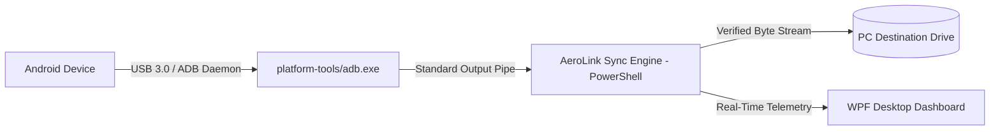

  <h1>⚡ AeroLink Pro</h1>
  
<strong>Universal High-Speed Android ⟷ PC Data Transfer & Storage Optimization Suite</strong>

  

    
    
    
    
    
  

---

## 📌 Problem: Why MTP Sucks
Standard Windows MTP (Media Transfer Protocol) connections freeze, crash during multi-gigabyte video transfers, refuse to copy hidden app data, and throttle USB 3.0 throughput down to 5–15 MB/s.

**AeroLink Pro** eliminates MTP bottlenecks completely. By streaming raw data packets directly through the native Android Debug Bridge (ADB) pipe, AeroLink unleashes your phone's full USB 3.0/3.2 hardware bandwidth—achieving sustained speeds between **40 MB/s and 100+ MB/s**.

---

## 🚀 Key Features

- **🌐 Universal Android Compatibility**: Auto-detects manufacturer and product model across all major Android ecosystems (Samsung, Pixel, Xiaomi, OnePlus, Vivo, Oppo, Motorola, Realme, Asus, etc.).
- **⚡ Hardware-Accelerated ADB Pipeline**: Bypasses Windows Explorer driver locks for reliable, crash-free file transfers.
- **🛡️ Zero Data-Loss Verified MOVE Mode**: Phone files are only deleted if and when the local PC file has been byte-verified for exact size integrity.
- **⏭️ Smart Auto-Skip**: Scans destination storage and instantaneously skips already backed up files without re-transferring.
- **🎨 Modern Native Dark UI**: WPF / XAML graphical interface with live battery monitoring, dynamic device status pill, transfer progress bars, and custom destination picker.
- **💻 Headless CLI Mode**: Includes `AEROLINK_CONSOLE.bat` for automated, scriptable terminal execution.
- **📦 Completely Portable**: Bundled with essential standalone ADB binaries—zero SDK or Android Studio installation required.

---

## 📱 Universal Device Compatibility

| Brand | Tested OS / Environments | Status |
| :--- | :--- | :--- |
| **Samsung** | Galaxy S / Z / A Series (One UI 3.0 – 6.1) | ✅ Verified |
| **Google** | Pixel 4 through Pixel 9 Pro (Stock Android 11 – 15) | ✅ Verified |
| **Xiaomi / Redmi / Poco** | HyperOS & MIUI 12 – 14 | ✅ Verified |
| **OnePlus / Oppo / Realme** | OxygenOS, ColorOS, Realme UI | ✅ Verified |
| **Vivo / iQOO** | Funtouch OS & OriginOS (All Y, V, X Series) | ✅ Verified |
| **Motorola / Lenovo** | Moto G, Edge, ThinkPhone | ✅ Verified |
| **Other Androids** | Any device running Android 7.0+ with USB Debugging | ✅ Verified |

---

## ⚡ Quickstart

### 1. Enable USB Debugging on Your Phone (One-Time Setup)
1. Go to your phone's **Settings** $\rightarrow$ **About Phone**.
2. Tap **Build Number** 7 times until you see *"You are now a developer!"*.
3. Go back to **System / Additional Settings** $\rightarrow$ **Developer Options**.
4. Enable **USB Debugging**.

### 2. Launch AeroLink on PC
Connect your phone with a USB cable and run:

- **GUI Interface**: Double-click [`AEROLINK.bat`](./AEROLINK.bat)
- **Console / CLI**: Double-click [`AEROLINK_CONSOLE.bat`](./AEROLINK_CONSOLE.bat)

When prompted on your phone screen, tap **"Always allow from this computer"** $\rightarrow$ **"Allow"**.

---

## 🏗️ Architecture

---

## 📄 License

Distributed under the **MIT License**. See [`LICENSE`](./LICENSE) for details.
